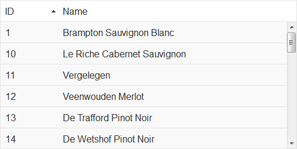

# React challenges

Not everything is important, but if you're in doubt, you can check our [evaluation criteria](../EvaluationCriteria.md).

## 1 - MERN-Seed login research:

Clone the [MERN-Seed][] project.

Create a branch from master following our GitHub conventions in case you want to implement the feature or just add comments/suggestions of the code that you review.

If we decided to implement a login form into the project, what will be the best approach to take? You can create a comparison table of the possible options and make a conclusion with what will be for you the best decision to take.

Bonus: implement the login based on your decision and make a PR with your changes.

## 2 - MERN-Seed login with JWT

Clone the [MERN-Seed][] project.

Create a branch from master following our GitHub conventions.

Implement a basic login using JWT.

Create a PR with your code so others devs can make a code review on it.

## 3 - MERN-Seed grid research

Clone the [MERN-Seed][] project.

Create a branch from master following our GitHub conventions in case you want to implement the feature or just add comments/suggestions of the code that you review.

If we decided to implement a generic grid component into the project, what will be the best approach to take? You can create a comparison table of the possible components around there and make a conclusion with what will be for you the best decision to take.

Bonus: implement the grid component based on your decision and made a PR with your changes,

## 4 - MERN-Seed grid example

Clone the [MERN-Seed][] project.

Create a branch from master following our GitHub conventions.

Create a new page in the project.

Implement a grid component with the following format:



The object what you will get from the API will be something like this:

```javascript
[
  { id: 1, name: 'Brampton Sauvignon Blanc', hasStock: false },
  { id: 10, name: 'Le Riche Cabernet Sauvignon', hasStock: true },
  { id: 11, name: 'Vergelegen', hasStock: false },
  { id: 12, name: 'Veenwouden Merlot', hasStock: true },
  { id: 13, name: 'De Trafford Pinot Noir', hasStock: true },
  { id: 14, name: 'De Wetshof Pinot Noir', hasStock: true },
  { id: 15, name: 'De Wetshof Limelight Chardonnay', hasStock: true },
  { id: 15, name: 'De Wetshof Pinor Noit Brut', hasStock: true }
]
```

You only need to display in the grid the elements that have stock.

## 5 - Google map challenge

This test should take about an hour to do.

Fork the following JSFiddle that has the base data:

https://jsfiddle.net/mravinale/Lyy64nwc/

Create a react app (in jsFiddle) that does the following:

- Uses a data service to get the data from the object in the fiddle above
- Uses the [echo service](http://doc.jsfiddle.net/use/echo.html) to make the get request on the http service.
- Handles the data in a way that produces something that fits the followings rules:
    - The array of listings need to show in the order given by the data service.
    - For the Price
        * It should have "$" and commas as thousand-separators.
        * If the Transaction is Rent, then it should also say "per month" after it
    - Open Houses are to look like:
        * Open House: Feb. 3rd - 2:00 AM to 3:30 PM
        * Only show the next open house that is to occur.
    - The overall format of the listing:
        * First line: Left Align Street Number + Street Name, right align price.
        * Second Line: Left Align Transaction
        * Third+ Lines: Open Houses centered in the format given above
    - Below the results, in a map that is 400x400, geocode the 2 addresses with google maps.
    - Clicking the marker for a listing, it should highlight that listing in the results. 

The JsFiddle already has GMaps loaded as an external resource if you fork it.

## 6 - Code review

Given the following code, can you identify the two main problems? Aside from that, point out any other improvement opportunities.

```jsx
class MyComponent extends React.Component {
    constructor(props) {
        // set the default internal state
        this.state = {
            clicks: 0
        };
    }

    componentDidMount() {
        this.refs.mainContainer.addEventListener(
            ‘click’, 
            this.clickHandler
        );
    }

    componentWillUnmount() {
        this.refs.mainContainer.removeEventListener(
            ‘click’, 
            this.clickHandler
        );
    }

    clickHandler() {
        this.setState({
            clicks: this.clicks + 1
        });
    }

    render() {
        let children = this.props.children;

        return (
            <div className=”main-container” ref=”mainContainer”>
                <h2>My Component ({this.state.clicks} clicks})</h2>
                <h3>{this.props.headerText}</h3>
                {children}
            </div>
        );
    }
}
```

[MERN-Seed]: https://github.com/MakingSense/mern-seed