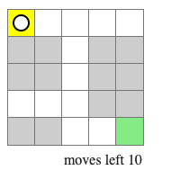
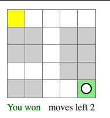
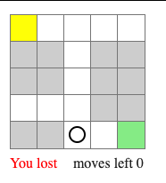

# Labyrinth challenge

We propose a challenge that requires you to build a small application that works as a game, using React.js.

The rules of the game are:

* The game is played in a square grid of N x M cells. The amount of cells is configurable.
  
* The player (the black and white circle) starts at a customizable initial position.
* The player can move using the keyboard arrow keys (up, down, left and right).
* The player has a limited amount of moves.
* The goal of the game is to move from the initial cell (yellow) to the target cell (green) before running out of moves.
* When the player reaches the target cell, they get a "You won!" message and they can't move anymore.
  
* When the player runs out of moves, they get a "You lost!" message, and they can't move anymore.
  

## Technical requirements

* You can add any library you consider that will help you build the game, as long as they are "regular web application" libraries. This means you can use libraries to help you with styles, state management, testing, etc. You cannot use libraries that are meant for building games.
* You have to test the application / components, covering as much functionality as you can.
* You have to build this application to the best of your abilities, considering customization and the possibility of extending it in the future.

## Nice to have

Not doing any of the following will **not** get you penalized, and you are **not** required to do any of them. If you decide to do any of them, they might add to your qualification, always considering the quality of the code you create.

* Visual improvements (e.g., the circle/cells could you images, or the movement could be animated)
* Restart functionality
* Level progression (win and go to the next level)
* High scores
* Level builder functionality
* "Fog of war"
* Anything you can think of that might add value!

## Starting files

For Semi-Sr and lower positions, we will be providing some initial files to get you started with some structure. For Sr positions, we expect you to start from scratch.

## Examples

Here are some examples of how we imagine that the game might end up looking. It's just for guidance.

### Example with positions in grid

<video src="labyrinth-challenge.assets/example-with-positions.mov"></video>

### Example with fog of war

<video src="labyrinth-challenge.assets/example-with-fog-of-war.mov"></video>

### Example with different styles

<video src="labyrinth-challenge.assets//example-with-styles.mov"></video>