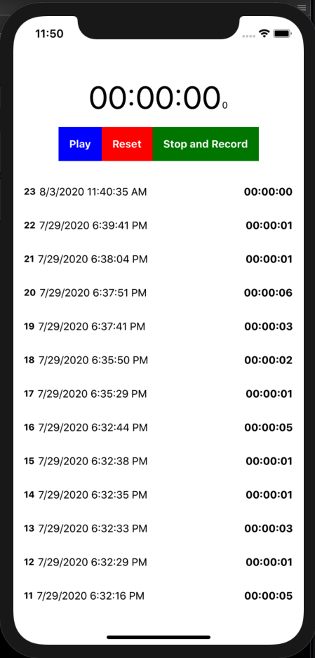

# React Native Chronometer challenge

We propose a challenge that requires you to build a small application that works as a chronometer, using React Native.

## App definitions

- There is a timer with these buttons:
  - `Play` will start the timer where it was left and might be visible only when not in the pause state.
  - `Pause` will pause the timer keeping it's value and might be visible only when not in the play state.
  - `Reset` will reset the timer's value to 0 and pause it.
  - `Stop and Record` will reset the timer's value to 0, pause it and record the value.
- There is a list of recorded values:
  - The list should show values recorded with the timer's `stop and record` button.
  - Values recorded should be populated when the application loads (so they have to be persisted between sessions).
  - Each timer value recorded on the list should have the timer value itself, a timestamp of when it was recorded and it should be ordered by recorded timestamp.

## Technical requirements

- You **CAN** add any library you consider that will help with styling, routing, development, state management or general UX. You **CAN'T** add any library that would solve the timer itself, it should be solved with what is already available on javascript /react.
- The application has to work on android.
- You have to test the application / components, covering as much functionality as you can and have a coverage report enabled.
- You have to build this application to the best of your abilities, considering customization and the possibility of extending it in the future.
- The challenge should be submitted using a git repository.

## Nice to have

- The application works on ios.
- An android `.apk` and/or ios `.app` files are submited.
- The application is written using `typescript`.

> _Not doing any of the following will **not** get you penalized, and you are **not** required to do any of them. If you decide to do any of them, they might add to your qualification, always considering the quality of the code you create._
>
> - Visual improvements (e.g., the circle/cells could use different clocks)
> - Sorting/filtering functionality
> - Having the list and timer on different screens
> - Keep the screen "always on" option
> - Anything you can think of that might add value!

## Example

Here is an example of how the application might end up looking. It's just for guidance.

